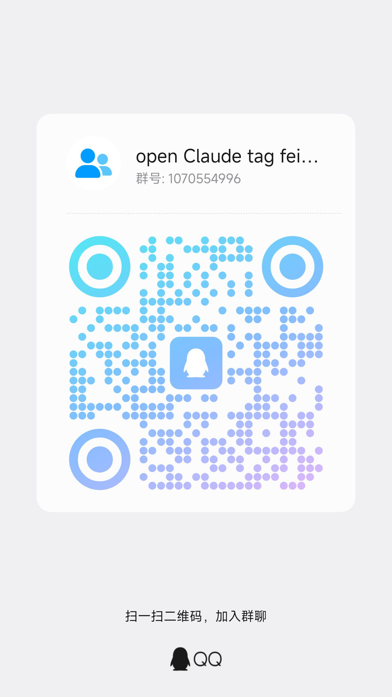

# 🤖 learn_hot_AIproject

> **Continuously sharing source-code deep-dive notes on trending AI open-source projects.**

<p align="center">
  English | <a href="./README.md">中文</a>
</p>

<p align="center">
  <a href="https://github.com/jiangdaxia-AI/learn_hot_AIproject/stargazers"></a>
  <a href="https://github.com/jiangdaxia-AI/learn_hot_AIproject"></a>
  <a href="https://github.com/jiangdaxia-AI/learn_hot_AIproject"></a>
  <a href="https://github.com/jiangdaxia-AI/learn_hot_AIproject"></a>
  
  
</p>

---

## 📖 Introduction

This repository deep-dives into trending AI open-source projects at the **source-code level** — method by method, class by class. Written for PMs, operators and non-technical readers in plain language: *what it does, why it matters, how it works*.

🔥 **Continuously updated** with more trending AI project analyses. ⭐ Star to stay tuned.

---

## 🗂️ Included Projects

| Project | Description | Tech Stack | Source Repo |
|---------|-------------|------------|-------------|
| **DeepTutor** | AI-driven lifelong personalized tutoring system by HKUDS Lab, multi-agent architecture | Python / FastAPI / RAG | [HKUDS/DeepTutor](https://github.com/HKUDS/DeepTutor) |
| **Clawith** | Open-sourced by dataelement, 6-layer architecture, 16,323 code nodes | — | [dataelement/Clawith](https://github.com/dataelement/Clawith) |
| **jcode** | Next-gen terminal AI coding agent written in Rust, 67 crates | Rust | [1jehuang/jcode](https://github.com/1jehuang/jcode) |

---

## 📂 Directory Structure

```
├── Clawith/       # Clawith source-code analysis (overview/architecture/modules/flow/entities)
├── DeepTutor/     # DeepTutor source-code analysis (12 parts, 38 chapters, layered)
│   └── API / Agent / Infrastructure / Service / Learning / Ability / Web / Tool / Flow / Entities
└── jcode/         # jcode source-code analysis (overview/architecture/modules/flow/entities)
```

Each project directory contains:

- `00-目录与阅读指南.md` — Full-book structure overview and reading roadmap
- `XX-系统全景.md` — Project positioning, target users, pain points, tech stack, competitors
- Layer-by-layer architecture and core module analysis
- `项目名-全书合并版.md` — All chapters merged into a single file

---

## 🧭 Reading Guide

| Reader | Recommended Path |
|--------|------------------|
| 🧑‍💼 PM / Ops | Start with the "System Overview" chapter for a quick big picture |
| 🏗️ Architect | Focus on "Architecture Overview" and "Core Flows" |
| 💻 Developer | Go deep via "Core Modules → Data Entities" |
| ⚡ Quick Look | Just read the "System Overview" chapter of each project |

---

## 🔬 Methodology

Notes are generated from **CodeGraph** code indexes (nodes + edges) combined with source reading, covering functions / structs / methods and their call relations to ensure completeness and accuracy.

---

## ⭐ Star & Follow

If you find this repository helpful, please give it a ⭐ **Star** — it's the biggest motivation to keep updating!

---

## 💬 Contact

Want to discuss trending AI projects, share suggestions or feedback? Scan to add me on WeChat / join the QQ group:

<p align="center">
  
  &nbsp;&nbsp;
  
</p>
<p align="center">
  WeChat &nbsp;|&nbsp; QQ Group
</p>

---

## 👤 Maintainer

- Maintainer: **jiangdaxia** ([@jiangdaxia-AI](https://github.com/jiangdaxia-AI))
- Continuously curating source-code analyses of trending AI projects.
